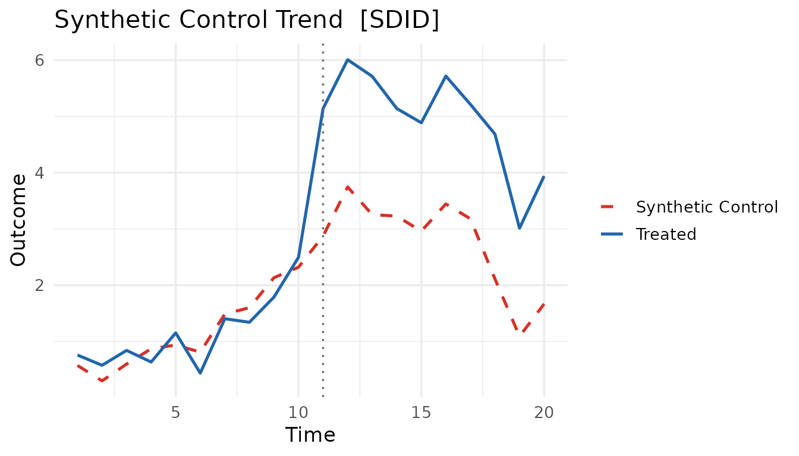
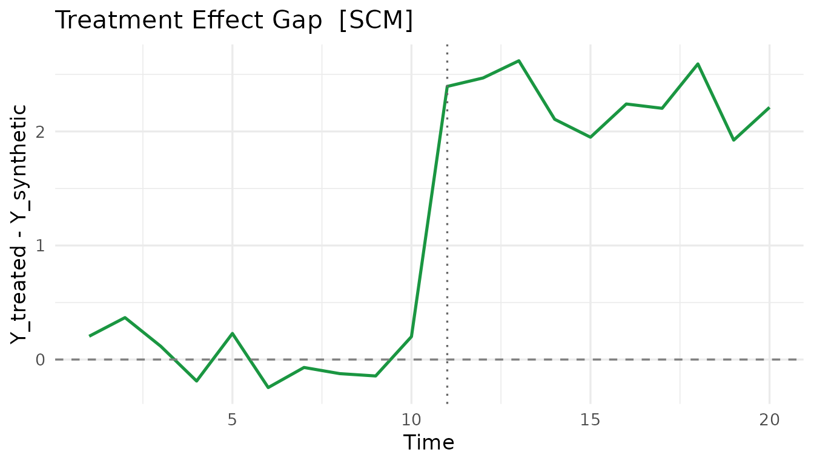
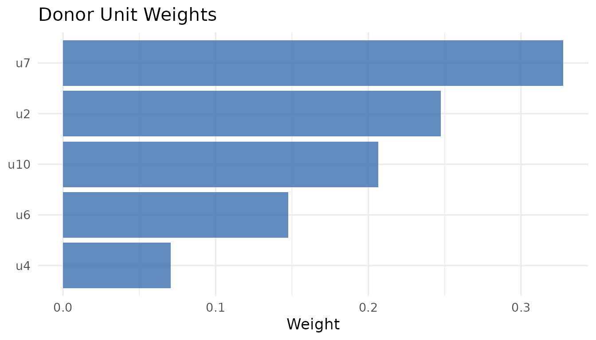

# Get started with coresynth

**coresynth** provides six causal-inference estimators for panel data
behind a single formula interface, with the computational core (QP
solving, SVD, Kalman filtering) written in C++ via RcppArmadillo. This
vignette walks through the basics: fitting a model, comparing methods,
and pulling results out with `broom` and
[`plot()`](https://rdrr.io/r/graphics/plot.default.html).

``` r

library(coresynth)
```

## The unified formula

Every estimator is reached through
[`scm_fit()`](https://yo5uke.com/coresynth/reference/scm_fit.md) with
the same formula syntax:

    outcome ~ treatment | unit_id + time_id

The data must be a **long-format** balanced panel (one row per
unit–time), and `treatment` is a 0/1 indicator that switches on for
treated units in post-treatment periods. `method =` selects the
estimator.

## A toy panel

We simulate a balanced panel of 10 units over 20 periods. Unit `u1` is
treated from period 11 onward with a true ATT of 2.0.

``` r

set.seed(42)
N <- 10; TT <- 20; T_pre <- 10
f   <- cumsum(rnorm(TT, 0, 0.5))     # common factor
lam <- rnorm(N, 1, 0.3)              # unit loadings
dat <- expand.grid(time = seq_len(TT), id = paste0("u", seq_len(N)))
dat$y <- as.vector(outer(f, lam)) + rnorm(nrow(dat), 0, 0.3)
dat$d <- as.integer(dat$id == "u1" & dat$time > T_pre)
dat$y[dat$d == 1] <- dat$y[dat$d == 1] + 2.0   # inject the treatment effect

head(dat)
#>   time id         y d
#> 1    1 u1 0.7590559 0
#> 2    2 u1 0.5774968 0
#> 3    3 u1 0.8414384 0
#> 4    4 u1 0.6355518 0
#> 5    5 u1 1.1532557 0
#> 6    6 u1 0.4384856 0
```

## Fitting one method

``` r

fit <- scm_fit(y ~ d | id + time, data = dat, method = "scm")
fit
#> === coresynth fit ===
#> Method : SCM 
#> Estimate (ATT): 2.2711 
#> Pre-treatment periods: 10
```

The estimated ATT lives in `fit$estimate`:

``` r

fit$estimate
#> [1] 2.271125
```

## Comparing all six methods

Because the interface is shared, swapping estimators is a one-word
change. Here we run all six on the same data (true ATT = 2.0).

``` r

methods <- c("scm", "sdid", "gsc", "mc", "tasc", "si")
fits    <- lapply(methods, function(m) scm_fit(y ~ d | id + time, data = dat, method = m))
names(fits) <- methods

data.frame(
  method   = methods,
  estimate = round(sapply(fits, `[[`, "estimate"), 3)
)
#>      method estimate
#> scm     scm    2.271
#> sdid   sdid    2.150
#> gsc     gsc    2.255
#> mc       mc    2.696
#> tasc   tasc    1.154
#> si       si    2.346
```

| Method | Reference                            |
|--------|--------------------------------------|
| `scm`  | Abadie, Diamond & Hainmueller (2010) |
| `sdid` | Arkhangelsky et al. (2021)           |
| `gsc`  | Xu (2017)                            |
| `mc`   | Athey et al. (2021)                  |
| `tasc` | Rho et al. (2026)                    |
| `si`   | Agarwal et al. (2025)                |

## Visualizing a fit

[`plot.coresynth()`](https://yo5uke.com/coresynth/reference/plot.coresynth.md)
offers three views via `type =`.

``` r

plot(fits$sdid, type = "trend")   # observed vs. synthetic
```



``` r

plot(fits$scm, type = "gap")      # treatment effect over time
```



``` r

plot(fits$scm, type = "weights")  # donor weights
```



## tidy / glance / augment

coresynth integrates with `broom`, so results drop straight into tidy
workflows and paper tables.

``` r

library(broom)

tidy(fits$scm)     # donor weights as a data frame
#>   term   estimate        type
#> 1   u2 0.24752069 unit_weight
#> 2   u3 0.00000000 unit_weight
#> 3   u4 0.07055224 unit_weight
#> 4   u5 0.00000000 unit_weight
#> 5   u6 0.14767482 unit_weight
#> 6   u7 0.32770301 unit_weight
#> 7   u8 0.00000000 unit_weight
#> 8   u9 0.00000000 unit_weight
#> 9  u10 0.20654924 unit_weight
glance(fits$scm)   # one-row model summary
#>   method estimate n_controls n_treated T_pre T_post staggered multi_arm
#> 1    scm 2.271125          9         1    10     10     FALSE     FALSE
```

[`export_json()`](https://yo5uke.com/coresynth/reference/export_json.md)
writes a fit to disk as JSON for reproducibility or downstream (e.g. AI)
workflows:

``` r

export_json(fits$scm, file = "scm_result.json")
```

## Where to next

- **[Estimators](https://yo5uke.com/coresynth/articles/estimators.html)**
  — covariates, predictors, and method-specific options for all six
  estimators plus the experimental-design variant.
- **[Inference](https://yo5uke.com/coresynth/articles/inference.html)**
  — placebo, bootstrap, jackknife, parametric, and conformal inference.
- **[Staggered
  adoption](https://yo5uke.com/coresynth/articles/staggered.html)** —
  cohort-based estimation when units adopt treatment at different times.
