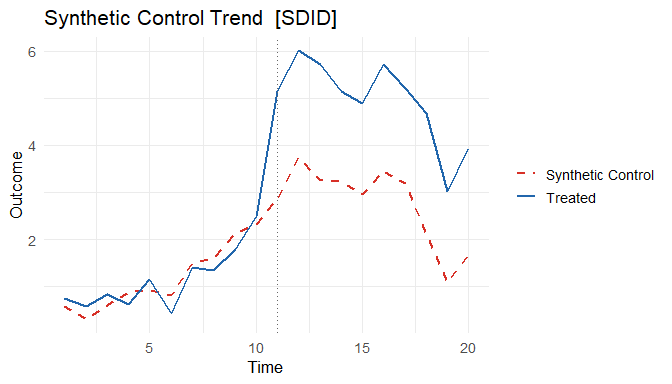
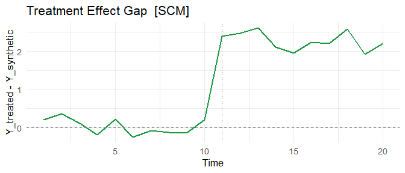
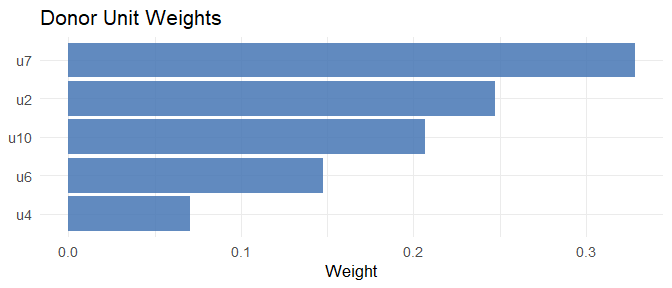

# coresynth

**coresynth** is a high-performance R package that provides six causal
inference methods for panel data through a unified formula interface.
All core optimizations (QP solving, SVD, Kalman filtering) are
implemented in C++ via RcppArmadillo, so estimation stays fast even on
larger donor pools (see the [Performance](#performance) section for
timings).

## Installation

``` r

# From GitHub (requires Rtools on Windows, Xcode on macOS)
pak::pak("yo5uke/coresynth")

# Via devtools
devtools::install_github("yo5uke/coresynth")
```

## Quick Start

``` r

library(coresynth)

# Generate a balanced panel (10 units, 20 periods, true ATT = 2.0)
set.seed(42)
N <- 10; TT <- 20; T_pre <- 10
f   <- cumsum(rnorm(TT, 0, 0.5))
lam <- rnorm(N, 1, 0.3)
dat <- expand.grid(time = seq_len(TT), id = paste0("u", seq_len(N)))
dat$y <- as.vector(outer(f, lam)) + rnorm(nrow(dat), 0, 0.3)
dat$d <- as.integer(dat$id == "u1" & dat$time > T_pre)
dat$y[dat$d == 1] <- dat$y[dat$d == 1] + 2.0   # true ATT = 2

# Run all six methods
methods <- c("scm", "sdid", "gsc", "mc", "tasc", "si")
fits    <- lapply(methods, \(m) scm_fit(y ~ d | id + time, data = dat, method = m))
names(fits) <- methods

# Compare ATT estimates (true value = 2.0)
data.frame(
  method   = methods,
  estimate = round(sapply(fits, `[[`, "estimate"), 3)
)
#>      method estimate
#> scm     scm    2.271
#> sdid   sdid    2.150
#> gsc     gsc    2.255
#> mc       mc    2.696
#> tasc   tasc    1.154
#> si       si    2.346
```

``` r

# SDID trend plot (observed vs. synthetic)
plot(fits$sdid, type = "trend")
```



``` r

# SCM gap plot (treatment effect over time)
plot(fits$scm, type = "gap")
```



``` r

# SCM donor weights
plot(fits$scm, type = "weights")
```



## Supported Methods

| Method | Reference | Treatment | Covariates | Inference |
|----|----|----|:--:|----|
| `scm` | Abadie, Diamond & Hainmueller (2010) | Sharp & Staggered | [`pred()`](https://yo5uke.com/coresynth/reference/pred.md) list | [`mspe_ratio_pval()`](https://yo5uke.com/coresynth/reference/mspe_ratio_pval.md), [`conformal_inference()`](https://yo5uke.com/coresynth/reference/conformal_inference.md) |
| `sdid` | Arkhangelsky et al. (2021) | Sharp & Staggered | `covariates=` | [`sdid_inference()`](https://yo5uke.com/coresynth/reference/sdid_inference.md), [`conformal_inference()`](https://yo5uke.com/coresynth/reference/conformal_inference.md) |
| `gsc` | Xu (2017) | Sharp & Staggered | `covariates=` time-varying | [`gsc_boot()`](https://yo5uke.com/coresynth/reference/gsc_boot.md), [`gsc_inference()`](https://yo5uke.com/coresynth/reference/gsc_inference.md), [`conformal_inference()`](https://yo5uke.com/coresynth/reference/conformal_inference.md) |
| `mc` | Athey et al. (2021) | Sharp & Staggered | — | [`conformal_inference()`](https://yo5uke.com/coresynth/reference/conformal_inference.md) |
| `tasc` | Rho et al. (2026) | Sharp & Staggered | — | — |
| `si` | Agarwal et al. (2025) | Sharp, Staggered & Multi-arm | — | [`si_inference()`](https://yo5uke.com/coresynth/reference/si_inference.md), [`conformal_inference()`](https://yo5uke.com/coresynth/reference/conformal_inference.md) |

[`conformal_inference()`](https://yo5uke.com/coresynth/reference/conformal_inference.md)
(Chernozhukov, Wüthrich & Zhu 2021) provides permutation-based p-values
and confidence intervals for **sharp** fits across
`scm`/`sdid`/`gsc`/`mc`/`si`.

## Staggered Adoption

All six methods support staggered adoption using a cohort-based approach
(Clarke et al. 2023): each adoption cohort is fitted separately and the
cohort ATTs are aggregated with weights proportional to
`N_treated × T_post`.

``` r

# u1: treated from t=11, u2: treated from t=16
dat_s        <- dat
dat_s$d      <- 0L
dat_s$d[dat_s$id == "u1" & dat_s$time > 10] <- 1L
dat_s$d[dat_s$id == "u2" & dat_s$time > 15] <- 1L
dat_s$y[dat_s$d == 1] <- dat_s$y[dat_s$d == 1] + 2.0

# All methods detect staggered timing automatically
fit_sdid <- scm_fit(y ~ d | id + time, data = dat_s, method = "sdid")
fit_gsc  <- scm_fit(y ~ d | id + time, data = dat_s, method = "gsc")
fit_mc   <- scm_fit(y ~ d | id + time, data = dat_s, method = "mc")
fit_si   <- scm_fit(y ~ d | id + time, data = dat_s, method = "si")

# Cohort-level estimates are accessible
fit_sdid$cohort_estimates
#>   cohort estimate weight n_treated T_pre T_post
#> 1     11    1.97  0.667         1    10      9
#> 2     16    2.03  0.333         1    10      4

# control_group = "clean" (default) uses never-treated + future-adopters as donors
# control_group = "never_treated" restricts to never-treated only
fit_sdid_clean <- scm_fit(y ~ d | id + time, data = dat_s, method = "sdid",
                          control_group = "never_treated")
```

## Covariates

### SCM: Predictor Variables via `pred()`

SCM supports covariate-based matching following Abadie et al. (2010)
§2.3. Use `pred(vars, times, op)` to specify which variables and time
windows to include in the predictor matrix:

``` r

# Assume dat has extra columns: income, unemp
fit_scm_cov <- scm_fit(
  y ~ d | id + time,
  data   = dat,
  method = "scm",
  predictors = list(
    pred(c("income", "unemp"), 1:8),   # average income & unemp over pre-period
    pred("y", 5),                       # outcome at a specific pre-treatment year
    pred("y", 1:4, op = "mean")         # outcome averaged over early pre-period
  )
)
summary(fit_scm_cov)   # shows predictor balance table
```

Each [`pred()`](https://yo5uke.com/coresynth/reference/pred.md) call
aggregates one or more variables over a time window using `op = "mean"`
(default), `"median"`, or `"sum"`. Multiple
[`pred()`](https://yo5uke.com/coresynth/reference/pred.md) calls with
different windows can be combined freely in the list.

### GSC: Time-Varying Covariates

GSC supports time-varying covariate adjustment via the full EM algorithm
of Xu (2017). Pass a character vector of column names as `covariates`:

``` r

# Assume dat has a time-varying column: gdp_growth
fit_gsc_cov <- scm_fit(
  y ~ d | id + time,
  data       = dat,
  method     = "gsc",
  r          = 2,
  covariates = "gdp_growth"
)
fit_gsc_cov$beta   # estimated beta coefficient(s)
```

The EM loop alternates between:

- **E-step**: SVD of $`\tilde{Y}_{it} = Y_{it} - x_{it}'\hat\beta`$ to
  update factors $`\hat{F}`$, $`\hat\Lambda`$
- **M-step**: Ridge OLS of residuals on $`x_{it}`$ to update
  $`\hat\beta`$

Treated unit loadings are estimated from covariate-demeaned
pre-treatment data per Xu (2017) Step 2. When `covariates = NULL`
(default), the plain 3-step SVD estimator ($`\hat\beta = 0`$) is used.

## Inference

``` r

# SCM: MSPE ratio placebo test (Abadie et al. 2010)
scm_p <- mspe_ratio_pval(fits$scm)
cat("p-value:", scm_p$p_value, "\n")

# SDID: four inference methods — placebo, bootstrap, jackknife, jackknife_global
sdid_inf <- sdid_inference(fits$sdid, method = "placebo")
tidy(sdid_inf)   # broom-style one-row data.frame

sdid_boot <- sdid_inference(fits$sdid, method = "bootstrap", n_boot = 200, seed = 1)
tidy(sdid_boot)

# GSC: parametric bootstrap under H0 (sharp only)
gsc_ci <- gsc_boot(fits$gsc, B = 200, alpha = 0.05)
cat("95% CI: [", gsc_ci$ci_lower, ",", gsc_ci$ci_upper, "]\n")

# GSC / SI: non-parametric inference (sharp + staggered)
gsc_inf <- gsc_inference(fits$gsc, method = "jackknife")
si_inf  <- si_inference(fits$si,  method = "bootstrap", n_boot = 200, seed = 1)
tidy(gsc_inf)
tidy(si_inf)

# Conformal inference (Chernozhukov, Wüthrich & Zhu 2021) — sharp fits for
# scm / sdid / gsc / mc / si. Re-estimates the counterfactual under the null
# and inverts a moving-block permutation test for a p-value and CI.
conf <- conformal_inference(fits$scm, tau0 = 0, level = 0.95)
tidy(conf)
```

## tidyverse / broom Integration

``` r

library(broom)

# Extract weights as a data frame
tidy(fits$scm)

# Summary row
glance(fits$scm)

# JSON export (for reproducibility and AI workflows)
export_json(fits$scm, file = "scm_result.json")
```

## Performance

Estimation stays fast even as the donor pool grows. SCM fit times
(Windows 11 / R 4.6.0 / GCC 14.2.0):

| N_co | T_pre | coresynth |
|-----:|------:|----------:|
|   16 |    10 |    105 ms |
|   20 |    20 |     72 ms |
|   50 |    30 |    916 ms |
|  100 |    40 |  6,300 ms |

A full SCM fit on a 100-donor pool completes in a few seconds.

## References

- Abadie, A., Diamond, A., & Hainmueller, J. (2010). Synthetic control
  methods for comparative case studies. *JASA*, 105(490), 493–505.
- Agarwal, A., Shah, D., & Shen, D. (2025). Synthetic interventions:
  extending synthetic controls to multiple treatments. *Operations
  Research*. <doi:10.1287/opre.2025.1590>
- Arkhangelsky, D., Athey, S., Hirshberg, D. A., Imbens, G. W., &
  Wager, S. (2021). Synthetic difference-in-differences. *AER*, 111(12),
  4088–4118.
- Athey, S., Bayati, M., Doudchenko, N., Imbens, G., & Khosravi, K.
  (2021). Matrix completion methods for causal panel data models.
  *JASA*, 116(536), 1716–1730.
- Chernozhukov, V., Wüthrich, K., & Zhu, Y. (2021). An exact and robust
  conformal inference method for counterfactual and synthetic controls.
  *JASA*, 116(536), 1849–1864.
- Rho, H., et al. (2026). Time-aware synthetic control. *Working paper*.
- Xu, Y. (2017). Generalized synthetic control method. *Political
  Analysis*, 25(1), 57–76.
